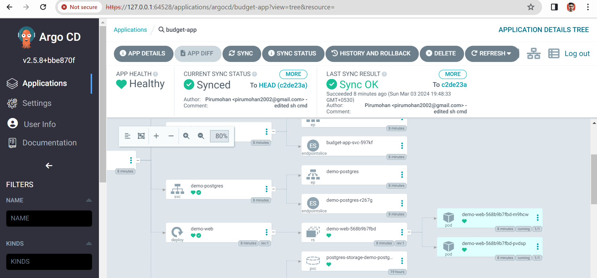

# Ruby on Rails app deployment with postgresql in Kubernetes with argocd

This Budget-app is created by https://github.com/evans22j/Budget-App

I containerized this application and deploy it to **Kubernetes**.


## files added 
* **docker-compose.yml**
* **Dockerfile**
* **entrypoint.sh**
* **multistage-Docker**
* **.env**
* **k8s-manifests** [folder for kubernetes manifest files]
## files edited
* **config>database.yml** [to add environmental vaiables]
* **config>environments>development.rb** [ added "config.web_console.permissions = '0.0.0.0'" line]

## Using Docker-compose
run the following commands
```bash
git clone https://github.com/MohanPiru/Budgetapp-deployment.git
cd Budgetapp-deployment
docker-compose up --build
```
* the application will be running on "localhost:3000"

## Using argocd
* after installing argocd set the repo "https://github.com/MohanPiru/Budgetapp-deployment.git"
* set the path "k8s-manifests"
* namespace=default
* and synchronize 

To see the app running in which ip in minikube
```bash
minikube service budget-app-svc
```



